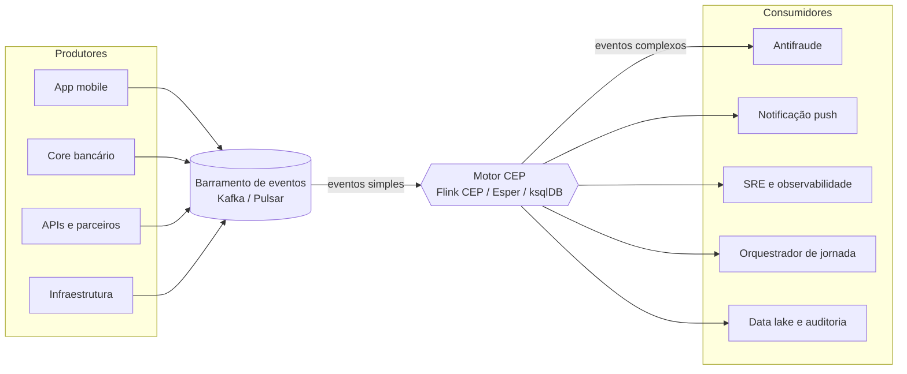
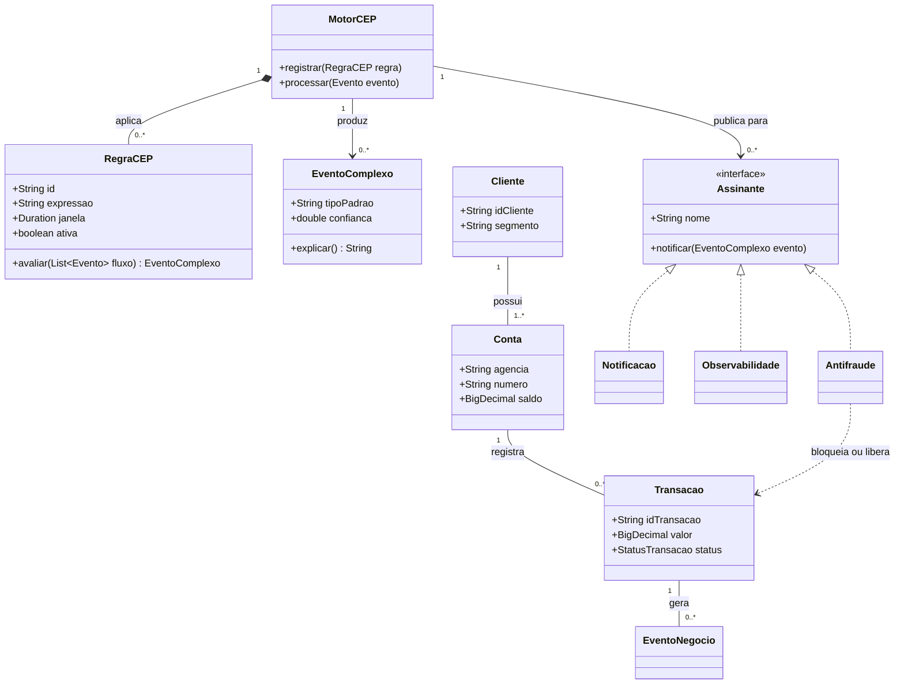
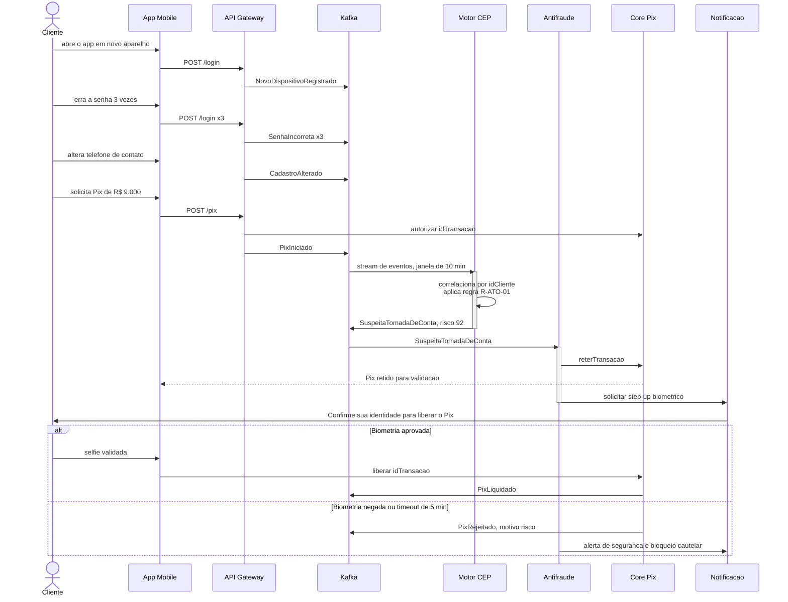
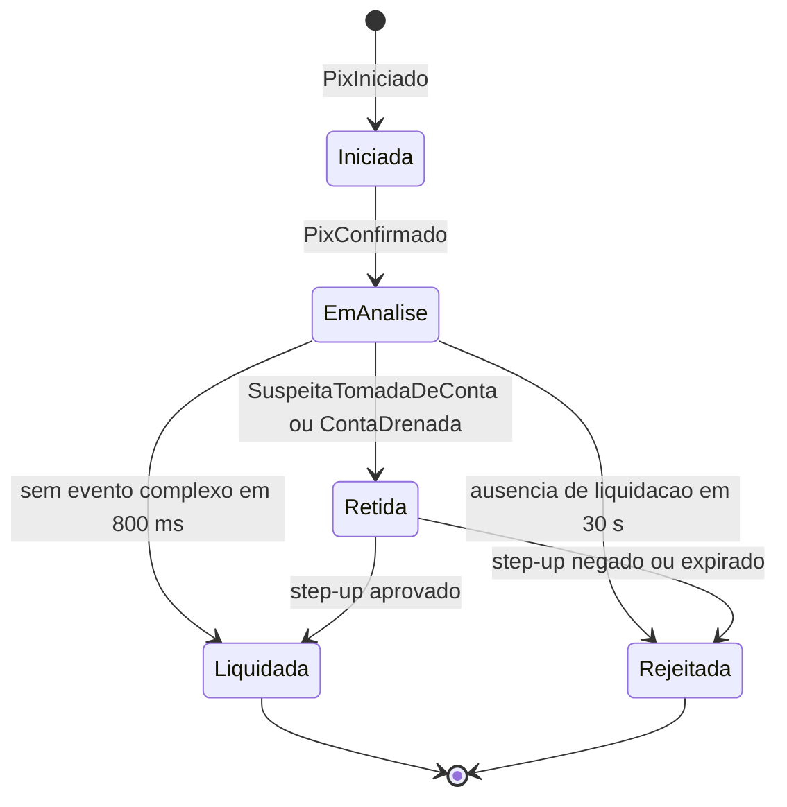

# Complex Event Processing (CEP) aplicado a um app bancário digital

> Ponderada de Computação - Semana 07

Este trabalho aplica o conceito de Processamento de Eventos Complexos a um
aplicativo bancário digital brasileiro, do tipo Nubank, BTG, Itaú ou Bradesco.
O texto começa pela definição de CEP, identifica em seguida os eventos simples e
complexos de negócio e técnicos desse domínio, apresenta a modelagem estática e
dinâmica em UML e termina com três cenários de negócio justificados.

## Definição de Complex Event Processing

Um evento é o registro imutável de algo que aconteceu, seja no mundo real, seja
dentro do sistema. Ele carrega sempre um identificador, um tipo, um carimbo de
tempo, a origem que o produziu e um payload de dados. A distinção fundamental,
e que costuma ser a maior fonte de confusão, é que evento não é estado: estado é
aquilo que a aplicação é neste instante, enquanto evento é o fato de que algo
ocorreu em determinado momento e não pode mais ser desfeito. Por isso eventos
não são atualizados, apenas acumulados, e é dessa característica que nasce toda
a possibilidade de reprocessamento e de auditoria posterior.

Chamamos de evento simples, ou atômico, aquele fato único que um produtor
observa diretamente e que não depende de nenhum outro evento para existir. Um
Pix que foi iniciado, uma senha digitada incorretamente ou uma chamada de API
que respondeu em 850 milissegundos são eventos simples: basta olhar para eles
para saber que aconteceram. Eles são baratos de gerar, existem aos milhares por
segundo em um banco digital e, isoladamente, carregam muito pouca informação de
valor. Uma senha errada, sozinha, é apenas um cliente distraído.

O evento complexo, ou derivado, é de outra natureza, porque ele não é observado:
ele é inferido. Um evento complexo nasce da correlação de dois ou mais eventos
simples dentro de uma janela de tempo, segundo um padrão previamente descrito.
Ninguém emite o evento "tomada de conta"; ele passa a existir quando o sistema
percebe que, nos últimos dez minutos, houve o registro de um dispositivo novo,
três tentativas de senha incorreta, a alteração do telefone de contato e, logo
depois, um Pix de valor muito acima do que aquele cliente costuma transferir.
Nenhum desses fatos, isolado, justificaria uma ação. Juntos, e nessa ordem, eles
descrevem uma fraude em andamento.

O Processamento de Eventos Complexos é, portanto, a técnica e a classe de
middleware que consome fluxos contínuos de eventos, aplica sobre eles regras
declarativas em tempo real e publica os eventos complexos resultantes, que por
sua vez disparam ações automáticas. A diferença em relação a uma abordagem
tradicional de BI ou de processamento em lote é menos de tecnologia e mais de
momento: o BI consulta dados parados, depois que o fato já se consumou, e
produz um relatório; o CEP consulta dados em movimento, enquanto o fato ainda
está acontecendo, e produz uma decisão. Um relatório de fraude em D+1 informa
quanto o banco perdeu, ao passo que uma regra de CEP avaliada em milissegundos
impede que a perda aconteça.

Para conseguir isso, um motor de CEP trabalha com um conjunto pequeno e bem
definido de operadores. O filtro seleciona apenas os eventos de interesse, como
transferências acima de cinco mil reais. A janela recorta o fluxo infinito em
pedaços tratáveis, seja por tempo, nos últimos cinco minutos, seja por
contagem, nos últimos dez eventos, e pode ser deslizante ou fixa. A sequência
exige que os eventos tenham ocorrido em determinada ordem. A ausência, que é
talvez o operador mais subestimado, detecta aquilo que deveria ter acontecido e
não aconteceu, como uma confirmação de Pix que não foi seguida da liquidação em
trinta segundos. A agregação sumariza o conteúdo da janela por meio de contagens,
somas, médias e percentis. A correlação junta fluxos diferentes por uma chave
comum, tipicamente o identificador do cliente ou da transação. E o
enriquecimento cruza o evento cru com dados de referência, como perfil, score e
histórico, para que a regra possa comparar o comportamento atual com o habitual.

Do ponto de vista arquitetural, o desenho é sempre o mesmo. Os produtores, que
no caso do banco são o aplicativo, o core bancário, as integrações com parceiros
e a própria infraestrutura, publicam eventos simples em um barramento como o
Kafka. O motor de CEP consome esse barramento, mantém o estado parcial das
janelas abertas e publica de volta os eventos complexos que detectou. Os
consumidores desses eventos complexos são os sistemas que efetivamente agem:
antifraude, notificação ao cliente, observabilidade, orquestração de jornada e
a trilha de auditoria.

---

## 1) Considere um aplicativo digital bancário (ex. Nubank, BTG, ITAU, Bradesco - marcas de bancos Brasileiros). Identificar eventos simples e complexos de negócios e técnicos envolvidos, segundo o conceito de CEP;

Em um aplicativo bancário os eventos se organizam em duas dimensões que vale a
pena separar desde o início. A primeira dimensão é a granularidade, que
distingue o evento simples do evento complexo, conforme definido acima. A
segunda é o domínio, que distingue o evento de negócio, gerado pela ação do
cliente ou pela movimentação do dinheiro, do evento técnico, gerado pelo
comportamento da plataforma que sustenta essa movimentação. Cruzando as duas
dimensões chegamos a quatro famílias, e é justamente o cruzamento entre elas,
como se verá no terceiro cenário, que produz as regras mais interessantes.

### Eventos simples de negócio

São os fatos gerados diretamente pelo uso do aplicativo. A jornada começa com
`AppAberto`, que traz o identificador do cliente, o do dispositivo, o carimbo de
tempo e a geolocalização, e prossegue com `LoginRealizado`, que registra o
método de autenticação utilizado, senha ou biometria. Quando a autenticação
falha, é emitido `SenhaIncorreta`, com o número da tentativa. Já autenticado, o
cliente gera `SaldoConsultado` a cada abertura da tela inicial.

O núcleo transacional do Pix produz uma sequência bem marcada de quatro eventos:
`PixIniciado`, quando o cliente preenche valor e chave de destino; `PixConfirmado`,
quando ele autoriza a operação; e então, de forma mutuamente exclusiva,
`PixLiquidado` ou `PixRejeitado`, este último sempre acompanhado do motivo. Ao
lado do Pix existem os demais eventos financeiros, como `CompraCartaoAutorizada`,
que carrega o MCC do estabelecimento, o valor e o país, e `BoletoPago`.

Há ainda os eventos de cadastro e de relacionamento, que parecem secundários mas
são decisivos para a detecção de fraude. `LimiteAlterado` registra a mudança do
limite de transferência, guardando o valor anterior e o novo. `CadastroAlterado`
registra a troca de e-mail ou telefone de contato. `NovoDispositivoRegistrado`
marca o primeiro acesso a partir de um aparelho desconhecido. Por fim,
`CreditoSimulado` e `JornadaAbandonada` capturam a intenção comercial do cliente
e o ponto exato em que ele desistiu de uma jornada.

### Eventos complexos de negócio

A partir desses fatos simples, o motor de CEP deriva eventos que descrevem
situações, e não mais ocorrências. O mais crítico deles é
`SuspeitaTomadaDeConta`, que é disparado quando, numa janela de dez minutos,
aparecem em conjunto um `NovoDispositivoRegistrado`, três ocorrências de
`SenhaIncorreta`, um `CadastroAlterado` e um `PixIniciado` de valor muito acima
da média histórica daquele cliente. A mesma lógica de correlação produz
`PadraoDeFraudeCartao`, quando três ou mais eventos `CompraCartaoAutorizada`
ocorrem em países ou categorias de estabelecimento distintos em quinze minutos
para o mesmo cartão, e `ContaDrenada`, quando a soma dos `PixConfirmado` em meia
hora ultrapassa oitenta por cento do saldo médio da conta e se distribui por
quatro ou mais chaves de destino nunca antes utilizadas.

Ainda no campo da segurança, `IndicioDeGolpeDoFalsoAtendente` combina um
`LoginRealizado` fora do horário habitual do cliente, um `LimiteAlterado` para
cima e um `PixIniciado` para chave nova, tudo em menos de cinco minutos e com
uma chamada telefônica ativa detectada no dispositivo. Esse é um bom exemplo de
padrão que nenhum dos eventos, isoladamente, permitiria identificar: aumentar o
limite é uma operação legítima e corriqueira, mas aumentar o limite durante uma
ligação, de madrugada, logo antes de transferir para um destinatário inédito é o
retrato de um golpe de engenharia social em curso.

Nem todo evento complexo de negócio tem a ver com fraude. `ClienteEmAtritoNaJornada`
é derivado por ausência: ocorre quando um `CreditoSimulado` é seguido de
`JornadaAbandonada` duas vezes em vinte e quatro horas sem que o evento de
contratação apareça. `RiscoDeChurn` surge da queda acentuada no volume de
consultas de saldo e de pagamentos ao longo de trinta dias, combinada com uma
portabilidade de salário iniciada. `OportunidadeDeCredito` aponta o movimento
contrário, isto é, o cliente com boletos em dia, uso crescente do cartão e score
estável nos últimos noventa dias. E `LiquidacaoPixNaoConfirmada` é um caso puro
de ausência técnica com consequência de negócio: houve `PixConfirmado`, mas o
`PixLiquidado` correspondente não chegou em trinta segundos.

### Eventos simples técnicos

Do lado da plataforma, os eventos descrevem o comportamento da infraestrutura e
das aplicações. O par `RequisicaoHttpRecebida` e `RespostaHttpEnviada` delimita
cada chamada e permite calcular latência e código de status. `ErroDeAplicacao`
registra exceções com serviço, stack trace e severidade. `TimeoutDeIntegracao`
marca a falta de resposta de um parceiro externo, tipicamente o SPI do Banco
Central no caso do Pix, e `CircuitBreakerAberto` registra o momento em que a
aplicação decidiu parar de chamar esse parceiro.

Completam o conjunto os eventos de mensageria e de operação:
`MensagemPublicadaNoTopico` e `ConsumerLagMedido`, que descrevem a saúde do
barramento; `DeployRealizado`, que identifica serviço e versão colocados em
produção; `UsoDeCpuMemoriaMedido`, por pod; `TokenDeSessaoExpirado` e
`TentativaDeAcessoNegada`, que ficam na fronteira entre o técnico e a segurança;
e `CrashDoAppMobile`, que traz a versão do aplicativo e o sistema operacional em
que a falha ocorreu.

### Eventos complexos técnicos

O mesmo raciocínio de correlação se aplica ao domínio técnico.
`DegradacaoDoServicoPix` é derivado quando o percentil 95 da latência ultrapassa
1200 milissegundos por três janelas consecutivas de um minuto, ou quando a taxa
de `TimeoutDeIntegracao` passa de cinco por cento no mesmo período. `DeployRuim`
correlaciona um `DeployRealizado` com o aumento superior a duzentos por cento nos
eventos de erro ou de crash da mesma versão nos quinze minutos seguintes, o que
equivale a atribuir automaticamente a causa de uma degradação à mudança que
acabou de entrar. `IndisponibilidadeDeParceiro` junta timeout e abertura de
circuit breaker no mesmo serviço em dois minutos, com origem única.

Há também `AtaqueDeCredentialStuffing`, que agrega mais de quinhentas tentativas
de acesso negado ou de senha incorreta em um minuto, vindas de faixas de IP
distintas e dirigidas a contas distintas, padrão que nenhuma análise individual
de conta detectaria. `BackpressureNaEsteira` observa o crescimento monotônico do
lag do consumidor por cinco janelas seguidas em conjunto com a degradação do
mesmo tópico. E `PerdaDeIntegridadeTransacional` faz a reconciliação por
ausência, detectando mensagens publicadas cujo evento de conclusão não chegou
dentro da janela de SLA.

Vale registrar, para fechar a questão, que o mesmo evento simples alimenta
várias regras ao mesmo tempo, e que a riqueza do CEP não está no evento em si,
mas no padrão temporal que se estabelece entre eles. `SenhaIncorreta` sozinho é
ruído operacional; correlacionado com troca de dispositivo, é o primeiro sinal
de uma fraude; agregado por faixa de IP, é indício de um ataque automatizado
contra toda a base de clientes.

---

## 2) Elaborar uma modelagem estática e dinâmica usando UML destes eventos;

A modelagem foi dividida da maneira clássica. A visão estática, expressa em
diagramas de classes, descreve como os eventos são estruturados e como se
relacionam entre si, ou seja, aquilo que não muda com o tempo. A visão dinâmica,
expressa em diagramas de sequência, de estados e de atividades, descreve o
comportamento do sistema ao longo do tempo, isto é, quem conversa com quem, como
uma transação muda de situação e como o motor processa cada evento. Os diagramas
abaixo estão em sintaxe Mermaid e são renderizados diretamente pelo GitHub.

### Modelagem estática: diagrama de classes

A hierarquia de eventos parte de uma classe abstrata `Evento`, que concentra os
atributos comuns a qualquer ocorrência da plataforma, e se especializa em duas
direções simultâneas. A primeira separa `EventoSimples`, que carrega apenas seu
payload, de `EventoComplexo`, que carrega o tipo de padrão que o originou, a
janela em que foi detectado, um grau de confiança e, principalmente, a lista dos
eventos que lhe deram origem. A segunda especializa o evento simples em
`EventoNegocio` e `EventoTecnico`, cada um com os atributos próprios do seu
domínio.

O ponto mais importante desse diagrama é a agregação entre `EventoComplexo` e
`Evento`, com multiplicidade de dois ou mais. Ela não é um detalhe de
implementação: é ela que garante a rastreabilidade do sistema. Como o evento
complexo guarda referência aos eventos que o originaram, sempre é possível
responder por que um alerta disparou e por que uma transação foi bloqueada,
requisito indispensável tanto para a auditoria interna quanto para o
atendimento ao cliente e para a resposta ao regulador.

O segundo diagrama estático mostra o motor de CEP e sua relação com o domínio
bancário propriamente dito. `RegraCEP` aparece como classe de primeira ordem, e
não como código espalhado pelos serviços, o que permite criar, versionar e
desativar regras sem novo deploy do core bancário. `Assinante` é modelado como
interface, de modo que antifraude, notificação e observabilidade consomem o
mesmo fluxo de eventos complexos sem que o motor precise conhecê-los.

### Modelagem dinâmica: diagrama de sequência

O diagrama de sequência abaixo percorre, do início ao fim, a detecção de uma
tentativa de fraude em Pix. Ele deixa visível o que talvez seja a principal
característica operacional do CEP: o motor não é chamado pelo fluxo transacional,
ele observa esse fluxo em paralelo. O gateway publica os eventos e segue adiante
com a autorização, enquanto o motor acumula esses mesmos eventos na janela de dez
minutos. Quando o padrão se completa, o evento complexo é publicado e o
antifraude, que é apenas mais um assinante, decide a ação e intervém na
transação.

O fragmento alternativo no final do diagrama é relevante porque mostra que a
detecção não termina em bloqueio. O cliente legítimo que passou pela verificação
biométrica tem sua transferência liberada em segundos, o que mantém o atrito em
um nível aceitável, enquanto o fraudador encontra uma barreira que não consegue
transpor.

### Modelagem dinâmica: diagrama de estados

O diagrama de estados descreve o ciclo de vida de uma transação Pix já sob
supervisão do motor. Ele traduz em máquina de estados aquilo que o diagrama de
sequência mostrou como conversa entre componentes.

Duas transições merecem comentário. A primeira é a que leva de `EmAnalise` para
`Liquidada` pela ausência de evento complexo em oitocentos milissegundos: como a
imensa maioria das transações é legítima, o caminho normal é justamente aquele
em que nenhuma regra dispara, e o desenho precisa deixar claro que o CEP não
pode atrasar o fluxo feliz. A segunda é a que leva a `Rejeitada` por ausência de
liquidação em trinta segundos, que é o operador de ausência aplicado ao ciclo de
vida e serve para impedir que uma transação fique presa indefinidamente por
falha de um sistema externo.

### Modelagem dinâmica: diagrama de atividades

Por fim, o diagrama de atividades detalha o que acontece dentro do motor a cada
evento recebido, desde a ingestão até a expiração das janelas vencidas.

A etapa de deduplicação por identificador de evento existe porque barramentos
como o Kafka garantem entrega ao menos uma vez, e uma mesma senha incorreta
contada duas vezes poderia disparar uma regra indevidamente. O enriquecimento
vem antes da avaliação porque quase toda regra interessante compara o
comportamento atual com o histórico do cliente. E a bifurcação depois da
publicação representa o paralelismo entre os assinantes, que agem de forma
independente sobre o mesmo evento complexo.

Em conjunto, os quatro diagramas respondem a perguntas diferentes e
complementares. O de classes responde como os eventos são estruturados e
relacionados, e é a visão estática pedida no enunciado. Os outros três compõem a
visão dinâmica: o de sequência mostra quem conversa com quem e em que ordem, o
de estados mostra como o objeto de negócio muda de situação ao longo do tempo, e
o de atividades mostra a lógica interna do processamento.

---

## 3) Criar cenários de Negócios - 3 cenários indicando como os eventos podem aprimorar a eficiência das transações. Justificar.

### Cenário 1: antifraude em tempo real no Pix

O primeiro cenário usa os eventos complexos `SuspeitaTomadaDeConta` e
`IndicioDeGolpeDoFalsoAtendente`. A regra correlaciona, em uma janela de dez
minutos e pela chave do cliente, o registro de um dispositivo novo, três
tentativas de senha incorreta, a alteração de dados cadastrais e um Pix cujo
valor seja pelo menos cinco vezes maior que a média histórica daquele cliente.
Quando o padrão se completa, a transação é retida por até cinco minutos, o
cliente recebe um push pedindo validação por biometria facial e a liberação só
ocorre se essa validação for bem sucedida.

A justificativa começa pela natureza do próprio Pix. Como o arranjo é
irrevogável e liquida em segundos, qualquer análise feita em lote no dia
seguinte só consegue produzir o relatório do prejuízo, nunca evitá-lo. O CEP
desloca a decisão para dentro da janela em que a perda ainda pode ser impedida,
e essa é a diferença entre registrar uma fraude e não sofrê-la. O segundo motivo
é de qualidade da decisão: como ela é tomada com base no contexto e não em um
atributo isolado, o índice de falso positivo cai bastante. Um Pix de valor alto,
sozinho, não bloqueia nada, e só se torna suspeito quando acompanhado dos demais
sinais. Isso importa diretamente para a eficiência das transações, porque cada
bloqueio indevido gera atrito com um cliente legítimo, uma ligação para a
central de atendimento e, com frequência, uma transação que deixa de ser
concluída. O resultado prático é a redução simultânea da perda operacional por
fraude, do custo com contestações no mecanismo especial de devolução e do
volume de atendimento, com melhora da percepção de segurança do cliente.

### Cenário 2: autocorreção da esteira transacional

O segundo cenário trabalha com os eventos complexos técnicos
`DegradacaoDoServicoPix`, `DeployRuim` e `IndisponibilidadeDeParceiro`. A regra
observa o percentil 95 da latência do serviço de Pix ao longo de janelas de um
minuto e a taxa de timeout com o SPI, e correlaciona qualquer anomalia com o
evento `DeployRealizado` mais recente daquele mesmo serviço. Detectada a
degradação, o sistema abre o circuit breaker, passa a liquidação para o modo
assíncrono, registrando a intenção de pagamento para liquidar assim que o
parceiro voltar, dispara o rollback automático da versão suspeita e abre o
incidente já com a causa provável anexada.

A justificativa mais direta é a redução do tempo de resposta a incidentes.
Correlacionar automaticamente o fato de que o serviço degradou com o fato de que
acabou de haver um deploy elimina a etapa mais cara e mais demorada de qualquer
incidente, que é descobrir a causa. O tempo de detecção e o tempo de reparo
deixam de ser medidos em dezenas de minutos e passam a ser medidos em segundos.
Do ponto de vista da eficiência das transações, o ganho é ainda mais concreto:
uma transferência que cairia em erro e obrigaria o cliente a tentar de novo mais
tarde, ou a desistir e usar outro banco, passa a ser enfileirada e liquidada
assim que a integração se restabelece, de modo que a receita não é perdida e sim
apenas deslocada no tempo. Há também um ganho de contenção de dano, porque sem o
circuit breaker o timeout do parceiro consome progressivamente o pool de
conexões da aplicação e acaba derrubando também as funções de saldo, extrato e
cartão, transformando uma falha localizada em indisponibilidade geral do
aplicativo.

### Cenário 3: orquestração da jornada e oferta no momento certo

O terceiro cenário combina os eventos complexos `ClienteEmAtritoNaJornada`,
`OportunidadeDeCredito` e `RiscoDeChurn`. A regra detecta, por ausência, o
cliente que simulou crédito e abandonou a jornada duas vezes em vinte e quatro
horas sem que o evento de contratação tenha ocorrido, e cruza esse padrão com o
histórico de boletos pagos em dia nos últimos seis meses. Em até dois minutos
após o abandono, o cliente recebe um push com a proposta já pré-aprovada na taxa
que ele mesmo simulou e um link que o devolve exatamente à etapa em que parou.
Há uma exceção importante na regra: se houve `ErroDeAplicacao` na mesma sessão,
a oferta não é enviada e o caso é encaminhado para atendimento proativo.

A justificativa se apoia em três pontos. O primeiro é que a intenção de compra
decai muito rapidamente, e uma campanha construída em lote chega horas ou dias
depois, quando o cliente já contratou o crédito no concorrente. O CEP aproxima a
oferta do pico de intenção, e essa proximidade temporal é o principal fator de
conversão. O segundo é que distinguir o cliente que desistiu daquele cuja
aplicação quebrou só é possível correlacionando evento de negócio com evento
técnico, cruzamento que nenhuma das duas áreas faria isoladamente. Ofertar para
quem acabou de enfrentar uma falha produziria irritação e reforçaria a má
experiência, ao passo que tratar a falha como atendimento proativo transforma um
defeito em um ponto positivo de relacionamento e reduz o chamado reativo que
viria depois. O terceiro é econômico: agir sobre o sinal precoce de churn custa
muito menos do que reconquistar um cliente já perdido, o que reduz tanto o custo
de aquisição quanto o de retenção.

---

## Síntese

Eventos simples são fatos isolados, abundantes e baratos de coletar, e
justamente por isso dizem pouco quando observados um a um. O valor do
Processamento de Eventos Complexos está em transformar esse fluxo bruto em
conhecimento acionável por meio da correlação temporal, e os três cenários
mostram que esse valor aparece em frentes bem distintas do banco: previne-se a
perda quando a fraude é barrada antes da liquidação, preserva-se a
disponibilidade quando a esteira transacional se autocorrige, e captura-se
receita quando a oferta chega no pico da intenção do cliente. Em todos os casos
o diferencial é o mesmo e é o que define a disciplina: decidir enquanto o fato
ainda está acontecendo, e não depois que ele já virou linha em um relatório.
