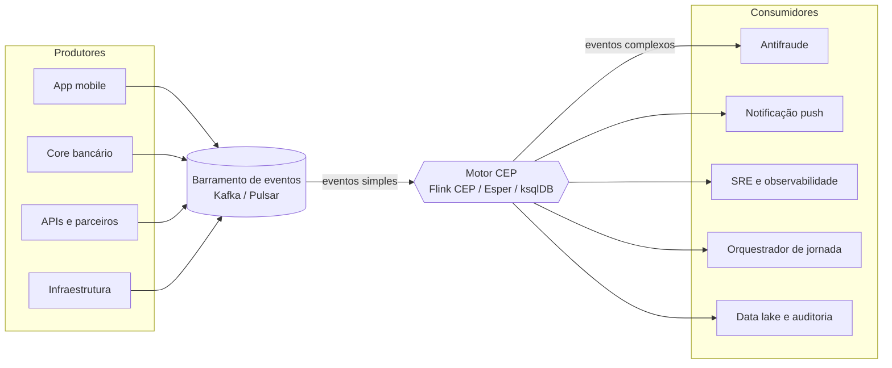
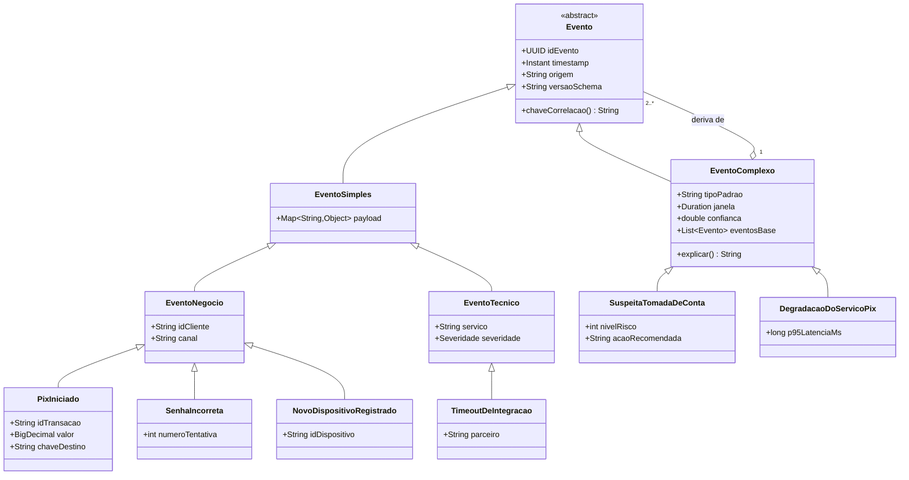
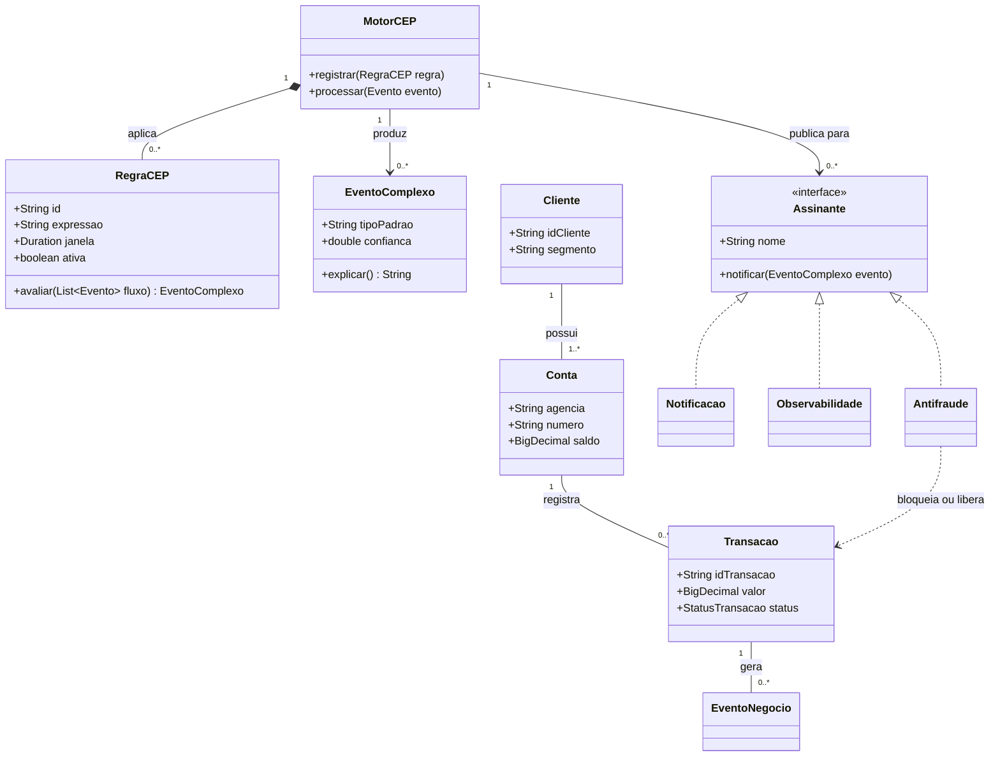
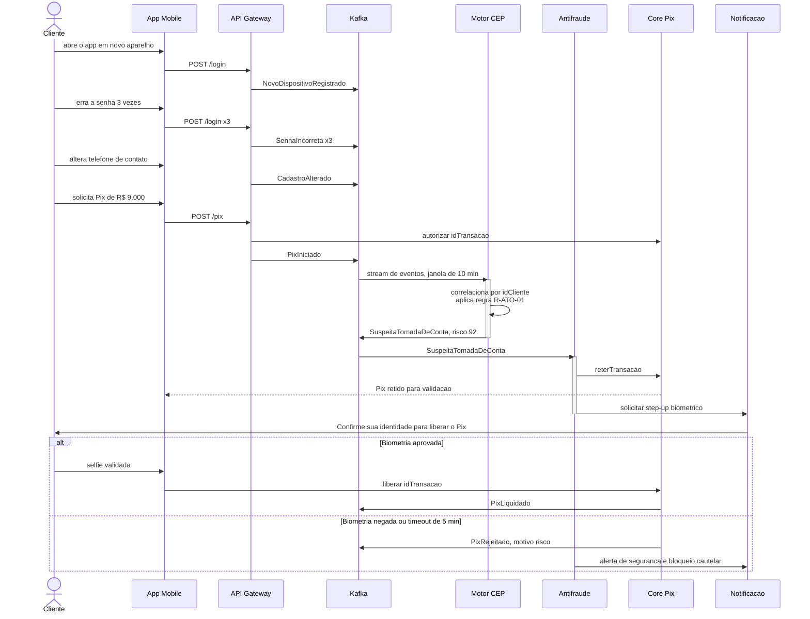
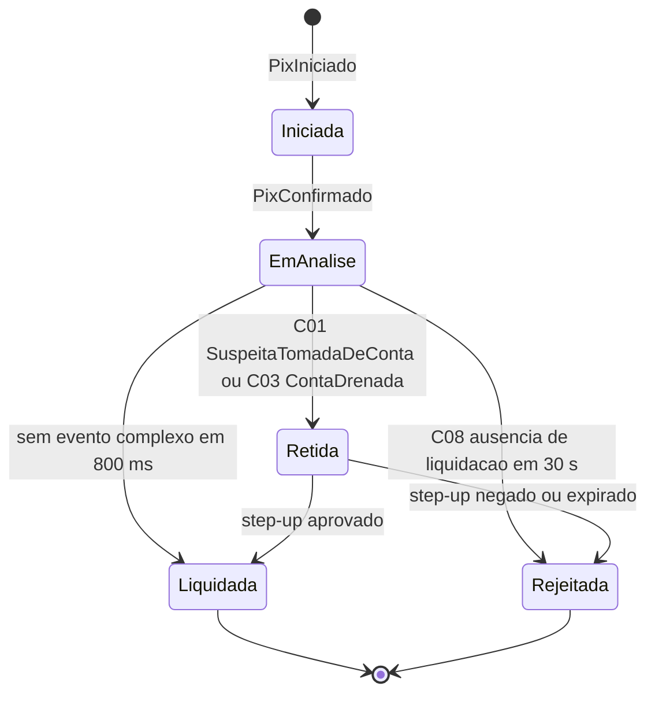
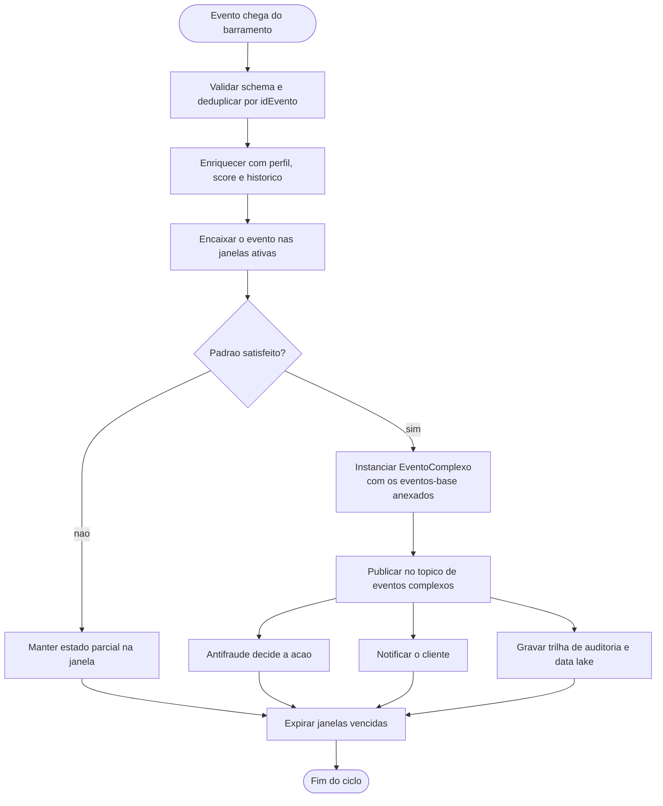

# Complex Event Processing (CEP) aplicado a um app bancário digital

> Ponderada de Computação - Semana 07

Estudo dirigido sobre Processamento de Eventos Complexos usando como domínio um
aplicativo bancário digital brasileiro (Nubank, BTG, Itaú, Bradesco).

## Sumário

- [1. O que é CEP](#1-o-que-é-cep)
- [2. Eventos simples e complexos do app bancário](#2-eventos-simples-e-complexos-do-app-bancário)
- [3. Modelagem UML](#3-modelagem-uml)
- [4. Cenários de negócio](#4-cenários-de-negócio)
- [5. Síntese](#5-síntese)

---

## 1. O que é CEP

### Evento

Registro **imutável** de algo que aconteceu no mundo real ou no sistema. Sempre
carrega identificador, tipo, carimbo de tempo (`timestamp`), origem (produtor) e
um payload de dados. Evento não é *estado*, é *fato ocorrido*.

### Evento simples (atômico)

Fato único, observado diretamente por um produtor, que não depende de nenhum
outro evento para existir.

> Exemplos: `Pix iniciado`, `senha digitada incorretamente`, `latência da API 850 ms`.

### Evento complexo (derivado / composto)

Fato que **não é observado diretamente**: ele é *inferido* pela correlação de
dois ou mais eventos simples dentro de uma janela de tempo, segundo um padrão.

> `3 senhas erradas` + `troca de dispositivo` + `Pix de valor atípico`, tudo em 2 minutos
> → evento complexo **`SuspeitaTomadaDeConta`**.

### CEP - Processamento de Eventos Complexos

Técnica e classe de middleware que consome fluxos contínuos de eventos
(*streams*), aplica regras declarativas sobre eles em tempo real
(milissegundos) e publica eventos complexos que disparam ações automáticas.

| | BI / Batch | CEP |
|---|---|---|
| Dados | parados, em repouso | em movimento, no fluxo |
| Momento | **depois** do fato | **durante** o fato |
| Latência | horas ou dias (D+1) | milissegundos |
| Resultado | relatório do prejuízo | ação que evita o prejuízo |

### Operadores típicos

| Operador | O que faz | Exemplo |
|---|---|---|
| **Filtro** | seleciona eventos de interesse | `valor > R$ 5.000` |
| **Janela** | recorta o fluxo no tempo ou por contagem | últimos 5 min (*sliding*) ou blocos fixos (*tumbling*) |
| **Sequência** | exige ordem entre eventos | `A` seguido de `B` seguido de `C` |
| **Ausência** | detecta o que **não** aconteceu | `A` ocorreu e `B` não ocorreu em 30 s |
| **Agregação** | sumariza dentro da janela | `count`, `sum`, `avg`, percentil |
| **Correlação** | junta streams por uma chave | `idCliente`, `idTransacao` |
| **Enriquecimento** | cruza com dados de referência | perfil, score, histórico |

### Arquitetura de referência

---

## 2. Eventos simples e complexos do app bancário

### 2.1 Eventos simples de negócio

O que o cliente faz.

| ID | Evento | Payload principal |
|---|---|---|
| `E01` | `AppAberto` | idCliente, idDispositivo, ts, geolocalização |
| `E02` | `LoginRealizado` | idCliente, método (senha/biometria), ts |
| `E03` | `SenhaIncorreta` | idCliente, númeroTentativa, ts |
| `E04` | `SaldoConsultado` | idCliente, ts |
| `E05` | `PixIniciado` | idTransacao, valor, chaveDestino, ts |
| `E06` | `PixConfirmado` | idTransacao, ts |
| `E07` | `PixLiquidado` | idTransacao, ts |
| `E08` | `PixRejeitado` | idTransacao, motivo, ts |
| `E09` | `LimiteAlterado` | idCliente, limiteAntigo, limiteNovo, ts |
| `E10` | `CompraCartaoAutorizada` | idCartao, mcc, valor, país, ts |
| `E11` | `BoletoPago` | idCliente, valor, ts |
| `E12` | `CadastroAlterado` | idCliente, campo (email/telefone), ts |
| `E13` | `NovoDispositivoRegistrado` | idCliente, idDispositivo, ts |
| `E14` | `CreditoSimulado` | idCliente, valor, prazo, taxa, ts |
| `E15` | `JornadaAbandonada` | idCliente, jornada, etapa, ts |

### 2.2 Eventos complexos de negócio

Inferidos por regra CEP a partir dos eventos acima.

| ID | Evento complexo | Regra de derivação |
|---|---|---|
| `C01` | `SuspeitaTomadaDeConta` (ATO) | `E13` **e** 3x `E03` **e** `E12` **e** `E05` muito acima da média do cliente, em janela de 10 min |
| `C02` | `PadraoDeFraudeCartao` | 3 ou mais `E10` em países ou MCCs distintos em 15 min, mesmo cartão |
| `C03` | `ContaDrenada` (cash-out) | `soma(E06)` em 30 min acima de 80% do saldo médio, com 4 ou mais chaves de destino inéditas |
| `C04` | `ClienteEmAtritoNaJornada` | `E14` seguido de `E15` duas vezes em 24 h, **sem** evento de contratação (*ausência*) |
| `C05` | `RiscoDeChurn` | queda de 70% ou mais no volume de `E04`/`E11` em 30 dias + portabilidade de salário iniciada |
| `C06` | `OportunidadeDeCredito` | `E11` recorrente e em dia + `E10` crescente + score estável em 90 dias |
| `C07` | `IndicioDeGolpeDoFalsoAtendente` | `E02` fora do horário habitual + `E09` (aumento de limite) + `E05` para chave nova, em menos de 5 min, com chamada telefônica ativa no device |
| `C08` | `LiquidacaoPixNaoConfirmada` | `E06` **sem** o `E07` correspondente em 30 s (*ausência*) |

### 2.3 Eventos simples técnicos

O que a plataforma faz.

| ID | Evento | Payload principal |
|---|---|---|
| `T01` | `RequisicaoHttpRecebida` | idRequisicao, endpoint, ts |
| `T02` | `RespostaHttpEnviada` | idRequisicao, statusCode, latenciaMs, ts |
| `T03` | `ErroDeAplicacao` | serviço, stacktrace, severidade, ts |
| `T04` | `TimeoutDeIntegracao` | serviço, parceiro (SPI/Bacen), ts |
| `T05` | `CircuitBreakerAberto` | serviço, ts |
| `T06` | `MensagemPublicadaNoTopico` | tópico, offset, ts |
| `T07` | `ConsumerLagMedido` | tópico, lag, ts |
| `T08` | `DeployRealizado` | serviço, versão, ts |
| `T09` | `UsoDeCpuMemoriaMedido` | pod, percentual, ts |
| `T10` | `TokenDeSessaoExpirado` | idSessao, ts |
| `T11` | `TentativaDeAcessoNegada` | idCliente, recurso, ip, ts |
| `T12` | `CrashDoAppMobile` | versãoApp, sistemaOperacional, ts |

### 2.4 Eventos complexos técnicos

| ID | Evento complexo | Regra de derivação |
|---|---|---|
| `CT1` | `DegradacaoDoServicoPix` | p95 de `T02.latenciaMs` acima de 1200 ms por 3 janelas consecutivas de 1 min, **ou** taxa de `T04` acima de 5% |
| `CT2` | `DeployRuim` (*bad release*) | `T08` seguido, em até 15 min, de aumento acima de 200% em `T03` ou `T12` na mesma versão |
| `CT3` | `IndisponibilidadeDeParceiro` | `T04` + `T05` no mesmo serviço em 2 min, com origem única (Bacen/SPI) |
| `CT4` | `AtaqueDeCredentialStuffing` | mais de 500 eventos `T11`/`E03` em 1 min, de faixas de IP distintas, contra contas distintas |
| `CT5` | `BackpressureNaEsteira` | `T07` crescente e monotônico por 5 janelas + `CT1` no mesmo tópico |
| `CT6` | `PerdaDeIntegridadeTransacional` | `T06` sem o evento de conclusão correspondente dentro da janela de SLA (*ausência*) |

> **Observação didática:** o mesmo evento simples alimenta várias regras. A riqueza
> do CEP não está no evento isolado, e sim no **padrão temporal** entre eles.
> Sozinho, `SenhaIncorreta` é ruído; correlacionado, é o primeiro sinal de fraude.

---

## 3. Modelagem UML

### 3.1 Modelagem estática - diagrama de classes

**Hierarquia de eventos**

**Motor CEP e domínio bancário**

**Leitura do modelo estático**

- `Evento` é a raiz abstrata: toda a plataforma fala a mesma linguagem.
- `EventoComplexo` **agrega** os eventos-base (relação `o--`), o que garante
  **rastreabilidade**: sempre é possível explicar por que o alerta disparou,
  requisito de auditoria e de compliance regulatório.
- `RegraCEP` é objeto de primeira classe: regras podem ser criadas, versionadas
  e desativadas sem novo deploy do core bancário.

### 3.2 Modelagem dinâmica - diagrama de sequência

Detecção de fraude em Pix, ponta a ponta.

### 3.3 Modelagem dinâmica - diagrama de estados

Ciclo de vida da transação Pix sob supervisão do CEP.

### 3.4 Modelagem dinâmica - diagrama de atividades

Pipeline interno do motor CEP.

### 3.5 Por que estes quatro diagramas

| Diagrama | Visão | O que responde |
|---|---|---|
| Classes | **estática** | como os eventos são estruturados e se relacionam |
| Sequência | dinâmica, de interação | quem conversa com quem e em que ordem |
| Estados | dinâmica, de ciclo de vida | como o objeto de negócio muda de situação |
| Atividades | dinâmica, de fluxo | a lógica interna do processamento |

---

## 4. Cenários de negócio

### Cenário 1 - Antifraude em tempo real no Pix

**Objetivo: evitar a perda.**

| | |
|---|---|
| **Eventos complexos** | `C01 SuspeitaTomadaDeConta`, `C07 GolpeDoFalsoAtendente` |
| **Regra** | `E13` + 3x `E03` + `E12` + `E05` com valor 5x acima da média histórica, em janela de 10 min |
| **Ação automática** | reter a transação por até 5 min, exigir biometria facial (*step-up*) e notificar o cliente por push |

**Justificativa de eficiência**

- O Pix é **irrevogável** e liquida em segundos. Análise em batch (D+1) só gera
  relatório de prejuízo; o CEP atua **dentro da janela** em que a perda ainda
  pode ser evitada.
- A decisão usa **contexto**, não um atributo isolado. Isso derruba o falso
  positivo: um Pix alto sozinho não bloqueia nada, só bloqueia quando vem
  acompanhado dos demais sinais. Menos bloqueio indevido significa menos atrito,
  menos ligação no call center e mais transação legítima concluída.
- Ganho mensurável: queda da perda operacional por fraude, do custo de
  contestação (MED) e melhora do NPS de segurança.

### Cenário 2 - Autocorreção da esteira transacional

**Objetivo: manter a disponibilidade.**

| | |
|---|---|
| **Eventos complexos** | `CT1 DegradacaoDoServicoPix`, `CT2 DeployRuim`, `CT3 IndisponibilidadeDeParceiro` |
| **Regra** | p95 de latência acima de 1200 ms em 3 janelas de 1 min, **ou** taxa de timeout com o SPI acima de 5%, correlacionado com o `T08 DeployRealizado` mais recente do mesmo serviço |
| **Ação automática** | abrir circuit breaker, mudar a liquidação para modo assíncrono, disparar rollback da versão e abrir incidente já com a causa provável anexada |

**Justificativa de eficiência**

- Correlacionar automaticamente *"degradou"* com *"acabamos de fazer deploy"*
  elimina a fase mais cara do incidente, que é descobrir a causa. **MTTD e MTTR
  caem de dezenas de minutos para segundos.**
- A transação que cairia em erro passa a ser enfileirada e liquidada depois: a
  receita não é perdida, apenas deslocada no tempo.
- Evita o efeito cascata. Sem circuit breaker, o timeout do parceiro consome o
  pool de conexões e derruba também saldo, extrato e cartão.

### Cenário 3 - Orquestração da jornada e oferta no momento certo

**Objetivo: gerar receita.**

| | |
|---|---|
| **Eventos complexos** | `C04 ClienteEmAtritoNaJornada`, `C06 OportunidadeDeCredito`, `C05 RiscoDeChurn` |
| **Regra** | `E14 CreditoSimulado` seguido de `E15 JornadaAbandonada` duas vezes em 24 h, **sem** evento de contratação (*ausência*), combinado com histórico de `E11 BoletoPago` em dia nos últimos 6 meses |
| **Ação automática** | em até 2 min após o abandono, enviar push com a proposta pré-aprovada na taxa já simulada e link direto para a última etapa preenchida. Se houve `T03 ErroDeAplicacao` na mesma sessão, **não** ofertar: acionar suporte proativo |

**Justificativa de eficiência**

- A intenção de compra decai rapidamente. Campanha em batch chega horas ou dias
  depois, quando o cliente já contratou no concorrente. O CEP aproxima a oferta
  do **pico de intenção** e eleva a taxa de conversão.
- Distinguir *"desistiu"* de *"o app quebrou"* só é possível correlacionando
  evento de negócio com evento técnico. Isso evita ofertar para quem sofreu
  falha, o que geraria irritação, e transforma um defeito em atendimento
  proativo, reduzindo chamados reativos.
- Agir no sinal precoce de churn custa muito menos do que reconquistar um
  cliente já perdido, reduzindo CAC e custo de retenção.

---

## 5. Síntese

Eventos simples são fatos isolados e baratos de coletar; sozinhos, dizem pouco.
O valor do CEP está em transformar esse fluxo em **conhecimento acionável** por
meio da correlação temporal, entregando ao banco três ganhos diretos:

1. **Previne-se a perda** - fraude barrada antes da liquidação.
2. **Preserva-se a disponibilidade** - esteira transacional que se autocorrige.
3. **Captura-se receita no instante certo** - oferta no pico da intenção.

Em todos os casos o diferencial é o mesmo: **decidir enquanto o fato ainda está
acontecendo**, e não depois que ele já virou prejuízo no relatório.
