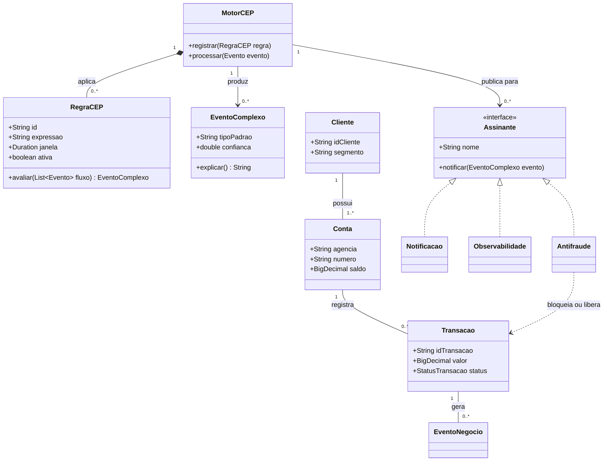
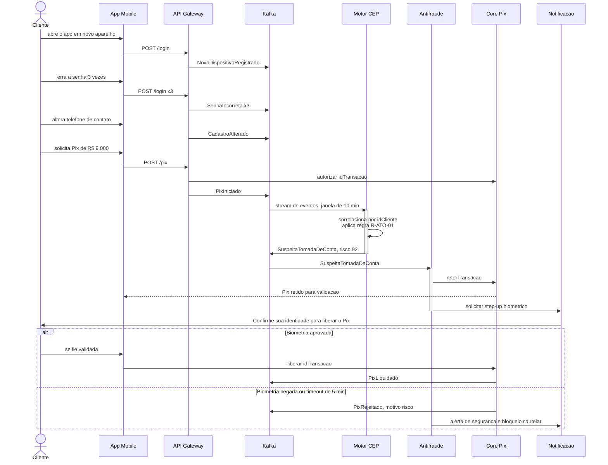
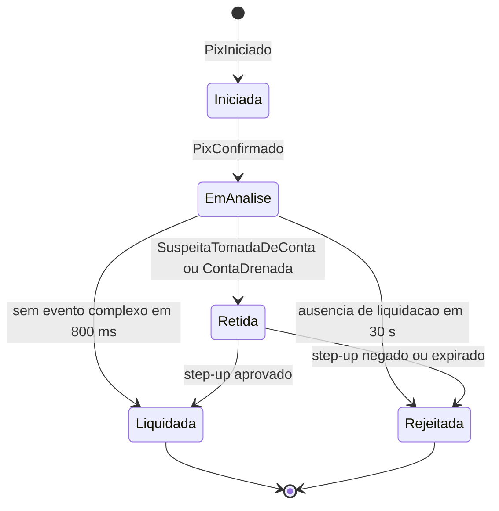

# Ponderada de Computação da Semana 07 - Complex Event Processing (CEP)

## 1) Considere um aplicativo digital bancário (ex. Nubank, BTG, ITAU, Bradesco - marcas de bancos Brasileiros). Identificar eventos simples e complexos de negócios e técnicos envolvidos, segundo o conceito de CEP;

Os eventos do aplicativo se organizam em duas dimensões. A granularidade separa
o evento simples do complexo, conforme definido acima; o domínio separa o evento
de negócio, gerado pela ação do cliente e pela movimentação do dinheiro, do
evento técnico, gerado pela plataforma que sustenta essa movimentação. Do
cruzamento das duas dimensões saem quatro famílias, e é justamente o cruzamento
entre elas que produz as regras mais interessantes.

### Eventos simples de negócio

A jornada começa com `AppAberto`, que traz cliente, dispositivo, horário e
geolocalização, e segue com `LoginRealizado`, que registra o método de
autenticação. Quando a autenticação falha, é emitido `SenhaIncorreta`, com o
número da tentativa, e o cliente já autenticado gera `SaldoConsultado`.

O núcleo transacional do Pix produz uma sequência bem marcada: `PixIniciado`,
quando o cliente preenche valor e chave de destino, `PixConfirmado`, quando ele
autoriza, e então, de forma mutuamente exclusiva, `PixLiquidado` ou
`PixRejeitado`. Ao lado dele estão `CompraCartaoAutorizada`, que carrega o MCC do
estabelecimento, o valor e o país, e `BoletoPago`.

Há ainda os eventos de cadastro e relacionamento, que parecem secundários mas são
decisivos para detectar fraude: `LimiteAlterado`, que guarda o limite anterior e
o novo, `CadastroAlterado`, para troca de e-mail ou telefone, e
`NovoDispositivoRegistrado`, que marca o primeiro acesso de um aparelho
desconhecido. `CreditoSimulado` e `JornadaAbandonada` capturam a intenção
comercial e o ponto exato em que o cliente desistiu.

### Eventos complexos de negócio

A partir desses fatos o motor deriva eventos que descrevem situações, e não mais
ocorrências. O mais crítico é `SuspeitaTomadaDeConta`, disparado quando, numa
janela de dez minutos, aparecem em conjunto um `NovoDispositivoRegistrado`, três
`SenhaIncorreta`, um `CadastroAlterado` e um `PixIniciado` muito acima da média
histórica do cliente. A mesma lógica produz `PadraoDeFraudeCartao`, quando três
ou mais `CompraCartaoAutorizada` ocorrem em países ou categorias distintas em
quinze minutos, e `ContaDrenada`, quando a soma dos `PixConfirmado` em meia hora
passa de oitenta por cento do saldo médio e se distribui por quatro ou mais
chaves inéditas.

Ainda na segurança, `IndicioDeGolpeDoFalsoAtendente` combina um `LoginRealizado`
fora do horário habitual, um `LimiteAlterado` para cima e um `PixIniciado` para
chave nova em menos de cinco minutos, com chamada telefônica ativa no
dispositivo. É um bom exemplo de padrão que nenhum evento isolado permitiria
identificar: aumentar o limite é operação corriqueira, mas aumentá-lo durante
uma ligação, de madrugada, logo antes de transferir para um destinatário inédito
é o retrato de um golpe de engenharia social em curso.

Nem todo evento complexo de negócio trata de fraude.
`ClienteEmAtritoNaJornada` é derivado por ausência, quando um `CreditoSimulado` é
seguido de `JornadaAbandonada` duas vezes em vinte e quatro horas sem que a
contratação apareça. `RiscoDeChurn` vem da queda acentuada em consultas de saldo
e pagamentos ao longo de trinta dias somada a uma portabilidade de salário
iniciada, e `OportunidadeDeCredito` aponta o movimento contrário, com boletos em
dia, uso crescente do cartão e score estável. Já `LiquidacaoPixNaoConfirmada` é
ausência pura: houve `PixConfirmado`, mas o `PixLiquidado` não chegou em trinta
segundos.

### Eventos simples técnicos

Do lado da plataforma, o par `RequisicaoHttpRecebida` e `RespostaHttpEnviada`
delimita cada chamada e permite calcular latência e código de status.
`ErroDeAplicacao` registra exceções com serviço, stack trace e severidade,
`TimeoutDeIntegracao` marca a falta de resposta de um parceiro externo, em geral
o SPI do Banco Central, e `CircuitBreakerAberto` registra o momento em que a
aplicação parou de chamá-lo.

Completam o conjunto `MensagemPublicadaNoTopico` e `ConsumerLagMedido`, que
descrevem a saúde do barramento, `DeployRealizado`, com serviço e versão,
`UsoDeCpuMemoriaMedido`, `TokenDeSessaoExpirado` e `TentativaDeAcessoNegada`, na
fronteira entre técnico e segurança, e `CrashDoAppMobile`.

### Eventos complexos técnicos

O mesmo raciocínio de correlação vale aqui. `DegradacaoDoServicoPix` é derivado
quando o percentil 95 da latência passa de 1200 milissegundos por três janelas
consecutivas de um minuto, ou quando a taxa de `TimeoutDeIntegracao` supera
cinco por cento. `DeployRuim` correlaciona um `DeployRealizado` com o aumento
acima de duzentos por cento nos erros ou crashes da mesma versão nos quinze
minutos seguintes, o que equivale a atribuir automaticamente a causa da
degradação à mudança que acabou de entrar.

Há também `AtaqueDeCredentialStuffing`, que agrega mais de quinhentas tentativas
negadas em um minuto vindas de IPs distintos contra contas distintas, padrão que
nenhuma análise individual detectaria, `BackpressureNaEsteira`, que observa o
crescimento monotônico do lag junto com a degradação do mesmo tópico, e
`PerdaDeIntegridadeTransacional`, que reconcilia por ausência as mensagens cujo
evento de conclusão não chegou dentro do SLA.

Vale registrar que o mesmo evento simples alimenta várias regras ao mesmo tempo,
e que a riqueza do CEP não está no evento em si, mas no padrão temporal entre
eles. `SenhaIncorreta` sozinho é ruído; com troca de dispositivo, é o primeiro
sinal de fraude; agregado por faixa de IP, é indício de ataque automatizado
contra toda a base.

---

## 2) Elaborar uma modelagem estática e dinâmica usando UML destes eventos;

A modelagem segue a divisão clássica. A visão estática, em diagramas de classes,
descreve como os eventos são estruturados e se relacionam, ou seja, o que não
muda com o tempo. A visão dinâmica, em diagramas de sequência, de estados e de
atividades, descreve o comportamento ao longo do tempo. Os diagramas estão em
sintaxe Mermaid e são renderizados diretamente pelo GitHub.

### Modelagem estática: diagrama de classes

A hierarquia parte da classe abstrata `Evento`, que concentra os atributos
comuns, e se especializa em duas direções. A primeira separa `EventoSimples`, que
carrega apenas seu payload, de `EventoComplexo`, que carrega o padrão que o
originou, a janela, um grau de confiança e a lista dos eventos que lhe deram
origem. A segunda especializa o evento simples em `EventoNegocio` e
`EventoTecnico`.

O ponto mais importante é a agregação entre `EventoComplexo` e `Evento`, com
multiplicidade de dois ou mais. Ela não é detalhe de implementação: é o que
garante rastreabilidade, porque permite responder sempre por que um alerta
disparou e por que uma transação foi bloqueada, requisito indispensável para a
auditoria, para o atendimento e para a resposta ao regulador.

O segundo diagrama mostra o motor e sua relação com o domínio bancário.
`RegraCEP` aparece como classe de primeira ordem, e não como código espalhado
pelos serviços, o que permite criar, versionar e desativar regras sem novo deploy
do core. `Assinante` é modelado como interface, de modo que antifraude,
notificação e observabilidade consomem o mesmo fluxo sem que o motor precise
conhecê-los.

### Modelagem dinâmica: diagrama de sequência

O diagrama abaixo percorre a detecção de uma tentativa de fraude em Pix e deixa
visível a principal característica operacional do CEP: o motor não é chamado
pelo fluxo transacional, ele observa esse fluxo em paralelo. O gateway publica os
eventos e segue com a autorização, enquanto o motor acumula esses mesmos eventos
na janela de dez minutos. Completado o padrão, o evento complexo é publicado e o
antifraude, que é apenas mais um assinante, decide a ação.

O fragmento alternativo no final importa porque mostra que a detecção não termina
em bloqueio: o cliente legítimo que passa pela verificação biométrica tem a
transferência liberada em segundos, o que mantém o atrito aceitável, enquanto o
fraudador encontra uma barreira que não consegue transpor.

### Modelagem dinâmica: diagrama de estados

O diagrama de estados traduz em máquina de estados aquilo que o de sequência
mostrou como conversa entre componentes, descrevendo o ciclo de vida de uma
transação Pix sob supervisão do motor.

Duas transições merecem comentário. A que leva de `EmAnalise` a `Liquidada` pela
ausência de evento complexo em oitocentos milissegundos deixa claro que o caminho
normal é aquele em que nenhuma regra dispara, e que o CEP não pode atrasar o
fluxo feliz. A que leva a `Rejeitada` por ausência de liquidação em trinta
segundos é o operador de ausência aplicado ao ciclo de vida, e impede que uma
transação fique presa indefinidamente por falha de um sistema externo.

### Modelagem dinâmica: diagrama de atividades

Por fim, o diagrama de atividades detalha o que acontece dentro do motor a cada
evento recebido, da ingestão até a expiração das janelas vencidas.

A deduplicação por identificador existe porque barramentos como o Kafka garantem
entrega ao menos uma vez, e a mesma senha incorreta contada duas vezes poderia
disparar uma regra indevidamente. O enriquecimento vem antes da avaliação porque
quase toda regra compara o comportamento atual com o histórico do cliente. A
bifurcação final representa o paralelismo entre os assinantes.

Em conjunto, os quatro diagramas respondem a perguntas complementares: o de
classes mostra como os eventos são estruturados e relacionados, e é a visão
estática pedida no enunciado; o de sequência mostra quem conversa com quem e em
que ordem, o de estados mostra como o objeto de negócio muda de situação, e o de
atividades mostra a lógica interna do processamento.

---

## 3) Criar cenários de Negócios - 3 cenários indicando como os eventos podem aprimorar a eficiência das transações. Justificar.

### Cenário 1: antifraude em tempo real no Pix

O primeiro cenário usa `SuspeitaTomadaDeConta` e
`IndicioDeGolpeDoFalsoAtendente`. A regra correlaciona, em janela de dez minutos
e pela chave do cliente, o registro de um dispositivo novo, três senhas
incorretas, a alteração de dados cadastrais e um Pix com valor pelo menos cinco
vezes maior que a média histórica. Completado o padrão, a transação é retida por
até cinco minutos, o cliente recebe um push pedindo validação por biometria
facial e a liberação só ocorre se essa validação for bem sucedida.

A justificativa começa pela natureza do Pix: como o arranjo é irrevogável e
liquida em segundos, qualquer análise feita em lote no dia seguinte só produz o
relatório do prejuízo, nunca o evita. O CEP desloca a decisão para dentro da
janela em que a perda ainda pode ser impedida. O segundo motivo é a qualidade da
decisão, já que ela é tomada por contexto e não por atributo isolado, o que
derruba o falso positivo: um Pix de valor alto sozinho não bloqueia nada, e só se
torna suspeito acompanhado dos demais sinais. Isso importa diretamente para a
eficiência das transações, porque cada bloqueio indevido gera atrito com um
cliente legítimo, uma ligação para a central e, com frequência, uma transação que
deixa de ser concluída. O resultado é a redução simultânea da perda por fraude,
do custo com contestações e do volume de atendimento.

### Cenário 2: autocorreção da esteira transacional

O segundo cenário trabalha com `DegradacaoDoServicoPix`, `DeployRuim` e
`IndisponibilidadeDeParceiro`. A regra observa o percentil 95 da latência do
serviço de Pix em janelas de um minuto e a taxa de timeout com o SPI, e
correlaciona qualquer anomalia com o `DeployRealizado` mais recente daquele
serviço. Detectada a degradação, o sistema abre o circuit breaker, passa a
liquidação para o modo assíncrono, registrando a intenção de pagamento para
liquidar quando o parceiro voltar, dispara o rollback da versão suspeita e abre o
incidente já com a causa provável anexada.

A justificativa mais direta é a redução do tempo de resposta a incidentes.
Correlacionar automaticamente o fato de que o serviço degradou com o fato de que
acabou de haver um deploy elimina a etapa mais cara de qualquer incidente, que é
descobrir a causa, e faz o tempo de detecção e de reparo cair de dezenas de
minutos para segundos. Do ponto de vista das transações o ganho é mais concreto
ainda: a transferência que cairia em erro, obrigando o cliente a tentar de novo
mais tarde ou a usar outro banco, passa a ser enfileirada e liquidada assim que a
integração se restabelece, de modo que a receita não é perdida e sim apenas
deslocada no tempo. Há ainda a contenção de dano, porque sem o circuit breaker o
timeout do parceiro consome o pool de conexões e acaba derrubando também saldo,
extrato e cartão, transformando uma falha localizada em indisponibilidade geral.

### Cenário 3: orquestração da jornada e oferta no momento certo

O terceiro cenário combina `ClienteEmAtritoNaJornada`, `OportunidadeDeCredito` e
`RiscoDeChurn`. A regra detecta por ausência o cliente que simulou crédito e
abandonou a jornada duas vezes em vinte e quatro horas sem contratar, e cruza
esse padrão com o histórico de boletos pagos em dia nos últimos seis meses. Em
até dois minutos após o abandono, o cliente recebe um push com a proposta já
pré-aprovada na taxa que ele mesmo simulou e um link que o devolve à etapa em que
parou. Há uma exceção importante: se houve `ErroDeAplicacao` na mesma sessão, a
oferta não é enviada e o caso vai para atendimento proativo.

São três os motivos. A intenção de compra decai muito rápido, e uma campanha
construída em lote chega horas ou dias depois, quando o cliente já contratou no
concorrente, enquanto o CEP aproxima a oferta do pico de intenção. Distinguir o
cliente que desistiu daquele cuja aplicação quebrou só é possível correlacionando
evento de negócio com evento técnico, cruzamento que nenhuma das duas áreas faria
isoladamente: ofertar para quem acabou de enfrentar uma falha reforçaria a má
experiência, ao passo que tratar a falha como atendimento proativo transforma um
defeito em ponto positivo de relacionamento e evita o chamado reativo que viria
depois. Por fim, agir sobre o sinal precoce de churn custa muito menos do que
reconquistar um cliente já perdido, reduzindo tanto o custo de aquisição quanto o
de retenção.
